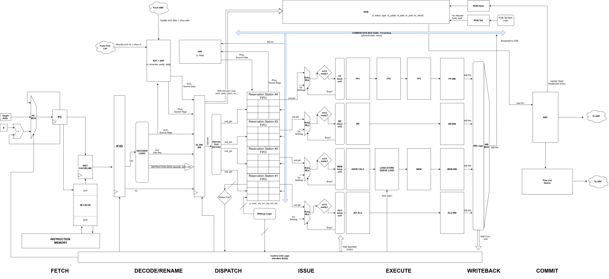

# Out-of-Order RISC-V Processor (RV32IM)

A fully synthesizable out-of-order (OoO) RISC-V processor implementing the RV32IM ISA, 
designed and built from scratch as part of a graduate computer architecture course. The 
processor achieves significant IPC improvements over a baseline in-order pipeline through 
dynamic scheduling, register renaming, and speculative execution.

---

## Architecture Highlights

| Component | Description |
|---|---|
| **Register Renaming** | Explicit RAT+ARF hybrid with PRF and RRF |
| **Reorder Buffer** | In-order commit with out-of-order execution |
| **Reservation Stations** | ALU, MUL/DIV, memory, and branch functional units |
| **Branch Predictor** | GShare with 10-bit GHR (~27% cycle count reduction) |
| **Load-Store Queue** | Age-based dynamic scheduling (~10% avg IPC improvement) |
| **Instruction Prefetcher** | Proactive next-line fetch (~13% fetch uptime improvement) |
| **Memory Arbiter** | Shared burst memory (BMEM) between I-cache and D-cache |

---
## Datapath

## Benchmarks

Validated against the following workloads using the RISC-V Formal Interface (RVFI) 
spec and the Spike reference model:

- Coremark
- AES-SHA
- FFT
- Mergesort
- Compression

---

## Tools & Technologies

- SystemVerilog
- Synopsys Design Compiler
- RISC-V ISA (RV32IM)
- Spike RISC-V Simulator

## Contact

For inquiries about the code or design report, please reach out to me directly.
